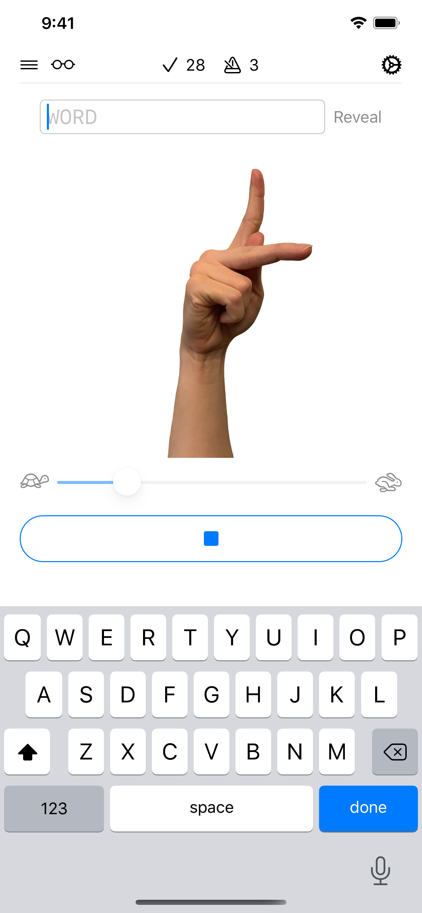

# Fingerspelling (iOS)

iOS app to practice American Sign Language (ASL) fingerspelling.

  

## Feedback? Ideas?

Open an [issue](https://github.com/sloria/Fingerspelling-iOS/issues)!

## License

[MIT Licensed](https://sloria.mit-license.org/).
